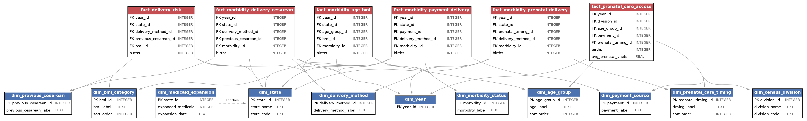
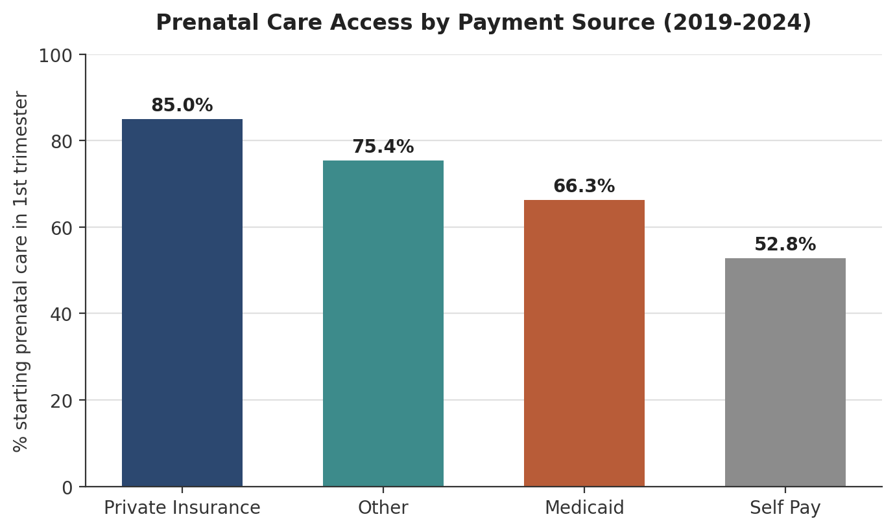
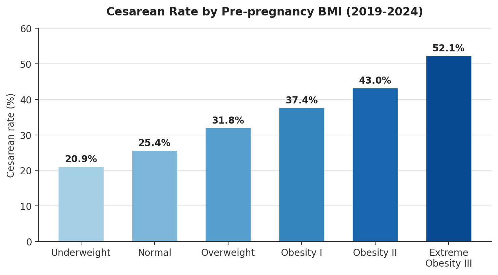
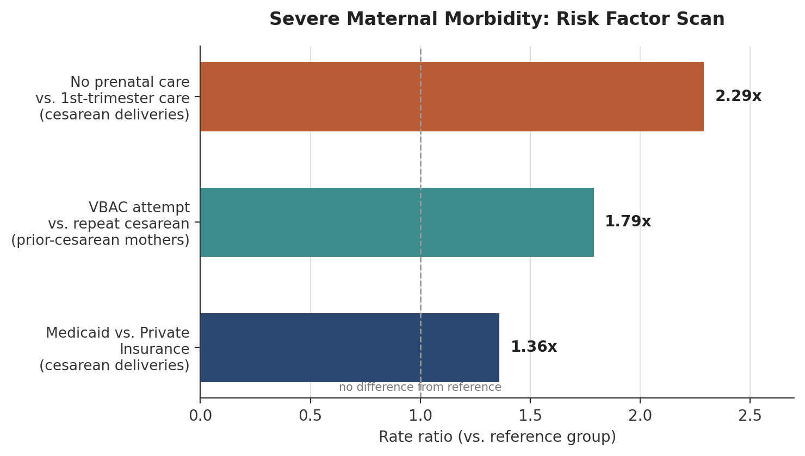

# Access, Intervention, Outcome: A Data-Driven Look at Maternal Health Disparities in the US

## Why I built this

I practiced as an OB/GYN in Colombia for several years. Colombia offers
universal health insurance to its citizens and legal residents, with
enrollment above 96% — there, access to care is limited far more often by
how remote a pregnant woman's location is than by whether she has insurance
at all. The United States is structured very differently: a decentralized,
largely private system built on employer-based coverage and government
programs like Medicare and Medicaid, without a universal safety net, leaving
many patients facing high out-of-pocket costs and real risk of medical debt.

Moving into data analysis, I wanted to know how that specific kind of access
limitation — driven by insurance status rather than geography — shows up in
maternal health outcomes. This project uses six years (2019-2024) of U.S.
birth certificate records from the CDC to investigate exactly that.

It's built entirely in SQL, on a database designed from scratch, using only
publicly available government data.

## Key findings

- **Access to prenatal care is sharply stratified by insurance status.**
  Mothers with private insurance start care in the 1st trimester 85% of the
  time; Medicaid mothers, 66%; self-pay mothers, 53%. The complete-lack-of-care
  rate for self-pay mothers is **8.6x** that of privately insured mothers.
- **Cesarean rate climbs in a clean, near-linear line with pre-pregnancy BMI**
  — from 21% at Underweight to 52% at Extreme Obesity — and the national
  cesarean rate itself has risen every year since 2019 (31.68% -> 32.38%).
- **The strongest predictor of severe maternal morbidity found in this data
  is the complete absence of prenatal care.** Among cesarean deliveries, no
  prenatal care carries **2.29x** the morbidity rate of care that began in
  the 1st trimester.
- **Insurance-based morbidity disparities are real, but not simple.** A raw,
  unstratified comparison suggests Medicaid mothers have *lower* morbidity
  than privately insured mothers — the opposite of what the access thesis
  predicts. Once you hold delivery method constant, Medicaid mothers show
  **1.36x** the morbidity rate of privately insured mothers within cesarean
  deliveries specifically — the opposite of what the unstratified
  comparison suggested.
- **Attempting a vaginal birth after a prior cesarean (VBAC) carries a real,
  measurable risk** — 1.79x the morbidity rate of a planned repeat cesarean —
  consistent with the known clinical risk of uterine rupture during a trial
  of labor after cesarean, and a reminder that "cesarean = risk" oversimplifies
  what's actually happening.

---

## The question this project investigates

Access shapes intervention, and intervention shapes outcome. The project is
structured around that pathway, as three chapters answering one connected
question rather than a grab-bag of unrelated queries:

1. **Access** — who gets prenatal care, when, and how much?
2. **Intervention** — who ends up with a cesarean, and what predicts it?
3. **Outcome** — who experiences severe maternal morbidity, and what's
   associated with it?

## Data source

[CDC WONDER, Natality — Birth Records (Expanded), 2016-2024](https://wonder.cdc.gov/natality-expanded-current.html),
restricted to birth years **2019-2024**. This is real government data — birth
certificate records for U.S. residents — not a synthetic or sampled dataset.

CDC WONDER only returns **pre-aggregated cross-tabs**, not row-level records:
each query can group by at most 5 variables, and any cell representing fewer
than 10 births is suppressed for privacy. That constraint shaped the whole
project — instead of one flat table, the data was pulled as **six separate
grouped exports**, each answering a different combination of questions, then
assembled into a relational database:

| Export | Grouping variables | Purpose |
|---|---|---|
| 1 | Year, Census Division, Age of Mother, Payment Source, Prenatal Care Timing | Chapter 1: Access |
| 2 | Year, State, Delivery Method, Previous Cesarean, Pre-pregnancy BMI | Chapter 2: Intervention |
| 3A | Year, State, Delivery Method, Previous Cesarean, Maternal Morbidity | Chapter 3: Outcome |
| 3B | Year, State, Age of Mother, Pre-pregnancy BMI, Maternal Morbidity | Chapter 3: Outcome |
| 3C | Year, State, Prenatal Care Timing, Delivery Method, Maternal Morbidity | Chapter 3: Outcome |
| 3D | Year, State, Payment Source, Delivery Method, Maternal Morbidity | Chapter 3: Outcome |

Two deliberate choices worth noting:

- **Export 1 uses Census Division, not State.** Combining Year x State x Age
  x Education x Prenatal Care Timing exceeded WONDER's 75,000-row output
  limit; Census Division (9 regions) keeps all four demographic variables
  intact at the cost of state-level precision in that one chapter only.
  Exports 2 and 3 use State throughout, since their variable combinations
  have lower cardinality.
- **Payment Source uses the basic 5-category field, not the "Expanded"
  9-category version.** Checking the WONDER documentation showed that a long
  list of states — including Florida, Illinois, Texas, and Pennsylvania —
  don't reliably report the Expanded field's extra categories for most of
  2019-2024, which would have introduced inconsistent gaps across exactly
  the states this analysis needed to compare.

"Maternal Morbidity Checked" (the outcome measure used throughout Chapter 3)
is a birth-certificate field indicating whether at least one of the following
was reported: maternal transfusion, 3rd/4th degree perineal laceration,
ruptured uterus, unplanned hysterectomy, or ICU admission. It's a proxy for
severe maternal morbidity, not the full clinical SMM definition used in
hospital-discharge-based research (see Limitations).

## Schema design

The database (`maternal_health.db`, SQLite) is a **fact constellation** —
six fact tables sharing ten conformed dimension tables — rather than a single
flat table, because each CDC export came back at its own grain. Conformed
dimensions (the same `dim_state`, `dim_year`, `dim_delivery_method`, and
`dim_morbidity_status` tables referenced by multiple fact tables) are what
let facts from different exports be joined together for cross-chapter
comparisons.



Full DDL: [`sql/schema.sql`](sql/schema.sql). ETL script (CSV -> SQLite):
[`sql/load_data.py`](sql/load_data.py).

---

## Chapter 1: Access

*[`sql/01_access_prenatal_care.sql`](sql/01_access_prenatal_care.sql)*

- **1st-trimester care initiation has been slowly eroding, not just dipping
  during COVID.** It held steady through the pandemic (75.9% in 2019, 76.75%
  in 2021) but has declined every year since, down to 74.09% by 2024.
- **Payment source predicts access more clearly than any other single
  factor tested:**

  | Payment source | % starting care in 1st trimester | % with no prenatal care at all |
  |---|---|---|
  | Private Insurance | 84.96% | 0.88% |
  | Medicaid | 66.34% | 2.92% |
  | Self Pay | 52.77% | 7.57% |

  

- **Teen mothers face the worst access of any age group.** Mothers under 15
  have a 9.58% no-prenatal-care rate — roughly 5x the rate for mothers in
  their late 20s/early 30s (~2%). Access is worst exactly where clinical
  risk is highest.
- **The Medicaid/Private gap holds in every census division** — it isn't
  explained away by any single region. West South Central (AR, LA, OK, TX)
  ranks lowest in average prenatal visit count for both payment types.

## Chapter 2: Intervention

*[`sql/02_intervention_delivery_risk.sql`](sql/02_intervention_delivery_risk.sql)*

- **National cesarean rate has climbed every year since 2019** — 31.68% to
  32.38% by 2024 — a slow, unbroken drift, not a pandemic-era anomaly.
- **Cesarean rate rises in a clean, near-linear line with pre-pregnancy BMI:**

  | Pre-pregnancy BMI | Cesarean rate |
  |---|---|
  | Underweight | 20.89% |
  | Normal | 25.36% |
  | Overweight | 31.79% |
  | Obesity I | 37.35% |
  | Obesity II | 43.03% |
  | Extreme Obesity III | 52.12% |

  

  Over half of extremely obese mothers deliver via cesarean, roughly double
  the rate at normal BMI.
- **Prior cesarean history is close to deterministic:** 85.51% of mothers
  with a previous cesarean have another one, vs. 22.33% of those without —
  consistent with the low U.S. VBAC uptake rate that ACOG has flagged as a
  policy concern for years.
- **State variation spans 15 points** — 23.04% (Alaska) to 38.25%
  (Mississippi), national average 30.89%. The five highest-rate states
  (Mississippi, Louisiana, Florida, Connecticut, Georgia) notably overlap
  with slower-access states from Chapter 1.

## Chapter 3: Outcome

*[`sql/03a_morbidity_delivery_cesarean.sql`](sql/03a_morbidity_delivery_cesarean.sql) |
[`03b_morbidity_age_bmi.sql`](sql/03b_morbidity_age_bmi.sql) |
[`03c_morbidity_prenatal_delivery.sql`](sql/03c_morbidity_prenatal_delivery.sql) |
[`03d_morbidity_payment_delivery.sql`](sql/03d_morbidity_payment_delivery.sql) |
[`04_risk_factor_summary.sql`](sql/04_risk_factor_summary.sql)*

A flat "cesarean vs. vaginal" comparison shows a nearly meaningless
difference (1.37% vs. 1.49%). Stratifying by a second variable in each of
the four sub-analyses below tells a much sharper story:

- **3A — VBAC attempts carry the elevated risk, not cesarean delivery
  broadly.** Among mothers
  with a prior cesarean, attempting a vaginal birth carries a 2.22% morbidity
  rate vs. 1.24% for a planned repeat cesarean — consistent with known
  uterine rupture risk during trial of labor after cesarean.
- **3B — age and BMI don't behave the way a clinical prior might predict.**
  Morbidity rate peaks at ages 30-34 (1.48%) and *declines* at higher BMI
  categories (Normal BMI: 1.62%, Extreme Obesity: 0.88%) — the opposite
  direction of BMI's relationship to cesarean rate in Chapter 2. This proxy
  for morbidity appears to track acute delivery events more than metabolic
  risk profile.
- **3C — the highest morbidity rate in the entire project is "no prenatal
  care + cesarean delivery"** (2.85%), more than double the rate for early
  care + cesarean (1.24%). Notably, this pattern doesn't hold for vaginal
  delivery, where "no care" shows a *lower* rate than early care — likely
  reflecting unplanned, fast deliveries with little opportunity for
  intervention to go wrong, a different population than "no care, followed
  by a complication serious enough to require surgery."
- **3D — the clearest demonstration of why stratification matters.** A raw
  comparison shows Private Insurance with the *highest* morbidity rate
  (1.63%), ahead of Medicaid (1.22%) — seemingly contradicting the access
  thesis. Stratified by delivery method, the picture reverses for cesareans
  specifically: Medicaid 1.59% vs. Private 1.17%. Private Insurance's higher
  overall rate turns out to be driven by its much larger share of vaginal
  deliveries, where it shows the highest rate of any payment/delivery
  combination in the table — a pattern this dataset alone can't fully
  explain, and a good example of a finding to flag rather than force into
  a clean story.
- **Risk factor summary — ranked by rate ratio:**

  | Risk factor (vs. reference group) | Rate ratio |
  |---|---|
  | No prenatal care vs. 1st-trimester care (cesarean deliveries) | 2.29x |
  | VBAC attempt vs. repeat cesarean (prior-cesarean mothers) | 1.79x |
  | Medicaid vs. Private Insurance (cesarean deliveries) | 1.36x |

  

  Read together with Chapters 1 and 2: the strongest predictor of severe
  morbidity found in this data is the absence of prenatal care, and its
  effect concentrates specifically in cesarean deliveries — the access ->
  intervention -> outcome pathway this project set out to test.

---

## Methodology: how the rate ratios were calculated

Every morbidity rate in this project uses the same formula:

```
morbidity_rate_pct = (births where "Maternal Morbidity Checked" = "At least one checked")
                      / (total births in that group) x 100
```

The risk-factor summary (Chapter 3) compares two groups at a time, **holding
delivery method constant by restricting all three comparisons to cesarean
deliveries** — this removes delivery method as a confounder from those
specific ratios. One group is then designated the reference (denominator):
the clinically recommended path (1st-trimester care), the more common
clinical default (repeat cesarean, given documented low VBAC uptake), or the
higher-resourced benchmark (Private Insurance). The other group's rate is
divided by the reference rate:

```
rate_ratio = group_rate_pct / reference_rate_pct
```

A ratio of 2.29 means the tested group's morbidity rate is 2.29x the
reference group's. **Which group counts as "reference" is an analytical
judgment call**, not something inherent to the data — a different analyst
could reasonably choose a different baseline.

These are **crude (unadjusted) rate ratios**: a standard, legitimate
epidemiological measure, but a limited one. Each factor is tested one at a
time, holding only delivery method constant by restriction — not age, BMI,
state, or any other variable simultaneously. See Limitations below.

## Limitations

- **Aggregated data, not row-level records.** CDC WONDER returns
  pre-aggregated cross-tabs (max 5 grouping variables, cells under 10 births
  suppressed). This project cannot support individual-level predictive
  modeling — only stratified comparisons of pre-aggregated group rates.
- **No mortality data.** Birth certificates only exist for live births —
  maternal mortality would require a separate CDC dataset (death
  certificates), out of scope here.
- **"Maternal Morbidity Checked" is a proxy, not the clinical SMM
  definition.** It reflects five specific birth-certificate checkboxes
  (transfusion, laceration, ruptured uterus, hysterectomy, ICU admission),
  not the full AHRQ severe maternal morbidity index, which draws on
  hospital discharge / ICD-coded data and captures more.
- **These are crude, unadjusted associations — not causal estimates, and not
  an adjusted multivariate model.** Each risk factor was tested one at a
  time. A factor's true independent effect, controlling for others
  simultaneously, would require row-level data and a statistical model.
- **Small-sample volatility at the extremes.** Age groups under 15 and 50+
  have very small underlying birth counts nationally; their rates (including
  the 0% figures in a few cells) are more volatile year-to-year than the
  central age bands, not necessarily lower true risk.
- **Ecological fallacy risk.** These are group-level (aggregate) statistics.
  Inferring an individual-level relationship directly from a group-level
  association is a known statistical error — the stratified comparisons here
  reduce that risk relative to a single marginal rate, but don't eliminate it.

## What I'd do with more access

- **Row-level data** (e.g., a state's vital records office, or a hospital
  discharge dataset like HCUP) to run an adjusted multivariate model —
  logistic regression or similar — estimating each factor's independent
  effect on morbidity while controlling for the others simultaneously.
- **Linkage to hospital discharge / ICD-coded data** to measure the full
  AHRQ severe maternal morbidity index, rather than the birth-certificate
  proxy used here.
- **A Medicaid expansion status lookup** (`dim_medicaid_expansion` is already
  scaffolded in the schema, unpopulated) joined against the state-level fact
  tables, to test whether the state-level cesarean and morbidity variation
  found in Chapters 2 and 3 tracks state Medicaid expansion policy —
  turning "geographic variation" into "policy-driven variation."
- **Maternal mortality data**, linked where possible, to extend the outcome
  chapter beyond morbidity.

## How to explore this yourself

SQLite was chosen deliberately over Postgres or another server-based
database: any reviewer can clone this repo and query the real database in
seconds, with no server to install and no credentials to configure. Nothing
in this analysis needs a Postgres-specific feature — CTEs and window
functions, which the analysis queries rely on throughout, are fully
supported in SQLite. The schema and queries are written in standard,
portable SQL, and would need only minor syntax changes (e.g. `AUTOINCREMENT`
-> `GENERATED ALWAYS AS IDENTITY`) to run on Postgres if this were headed
into production rather than a portfolio.

The database is a single SQLite file — no server setup required.

1. Download a free SQLite client, e.g. [DB Browser for SQLite](https://sqlitebrowser.org/).
2. Open `maternal_health.db`.
3. Run any query in `sql/01` through `sql/04` directly, or explore the
   tables listed under "Execute SQL."

To rebuild the database from the raw CDC exports (run from the project root):

```bash
python3 sql/load_data.py . maternal_health.db
```

## Project structure

```
maternal-health-access-sql/
├── README.md
├── maternal_health.db        # SQLite database (open directly, no setup)
├── data/
│   └── raw/                  # raw CDC WONDER export CSVs, as downloaded
├── docs/
│   ├── erd.png / erd.svg     # entity-relationship diagram (auto-generated from schema)
│   └── charts/               # findings charts, referenced in the README above
└── sql/
    ├── schema.sql            # DDL for all fact/dimension tables
    ├── load_data.py          # ETL: raw CDC CSVs -> SQLite
    ├── 01_access_prenatal_care.sql
    ├── 02_intervention_delivery_risk.sql
    ├── 03a_morbidity_delivery_cesarean.sql
    ├── 03b_morbidity_age_bmi.sql
    ├── 03c_morbidity_prenatal_delivery.sql
    ├── 03d_morbidity_payment_delivery.sql
    └── 04_risk_factor_summary.sql
```
